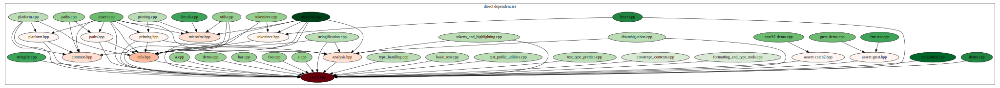

# build-blame

Build-blame is tool to help answer the question: Why are my builds taking so long??

This project is a work-in-progress.

## How to use:

Prerequisites:

- graphviz (`dot`)
- cmake
- ninja
- clang
- python3
- prettytable

In your project
```
cmake -B build -S . \
    -DCMAKE_CXX_COMPILER=clang++ \
    -DCMAKE_C_COMPILER=clang \
    -DCMAKE_BUILD_TYPE=Debug \
    -DCMAKE_EXPORT_COMPILE_COMMANDS=On \
    -GNinja \
    -DCMAKE_CXX_FLAGS=-ftime-trace \
    -DCMAKE_C_FLAGS=-ftime-trace
cmake --build build
```

Note: It is important to do this in a clean build folder so ninja's log is clear.

Then
```
python3 main.py --project-folder /path/to/project --output out
```

Other options:
```
--build folder  Folder where the cmake build lives (by default project-folder/build)
--output        Where to output blame info
--exclude       Exclude paths or files
-n              Number of entries to show for slow translation units, link targets, includes, instantiations, ...
```

The output folder will contain:
- `ninja_trace.json`: Approximate trace of how ninja parallelized the build and what targets took a lot of time or
  blocked others. Ninja's log records time info but it does not record thread assignments, so an attempt at roughly
  approximating the thread assignments is made. I recommend viewing this in [perfetto](https://ui.perfetto.dev/)
  (speedscope is popular but doesn't show threads side-by-side).


- `full_trace.json`: Ninja trace + clang time trace info combined into one.


- `includes.svg`: Include graph. Headers are colored based on the number of TU's transitively including them. Source
  files are colored by build time.



And lastly information on slow translation units, link targets, includes, instantiations, etc. will be written to
stdout.

## Example Statistics

Example output, on top of traces and graphs above:

```
Slowest translation unit targets:
    Time  Count  Target
  2.464s  1      /home/rifkin/projects/libassert/src/analysis.cpp
   2.01s  1      /home/rifkin/projects/libassert/build-clang/_deps/cpptrace-src/src/symbols/symbols_with_libdwarf.cpp
  1.682s  1      /home/rifkin/projects/libassert/src/assert.cpp
   1.66s  1      /home/rifkin/projects/libassert/build-clang/_deps/zstd-src/lib/compress/zstd_lazy.c
   1.45s  1      /home/rifkin/projects/libassert/build-clang/_deps/cpptrace-src/src/cpptrace.cpp
   1.39s  1      /home/rifkin/projects/libassert/src/paths.cpp
  1.359s  1      /home/rifkin/projects/libassert/build-clang/_deps/cpptrace-src/src/symbols/symbols_core.cpp
  1.282s  1      /home/rifkin/projects/libassert/src/utils.cpp
  1.192s  1      /home/rifkin/projects/libassert/build-clang/_deps/cpptrace-src/src/ctrace.cpp
  1.184s  1      /home/rifkin/projects/libassert/build-clang/_deps/cpptrace-src/src/snippets/snippet.cpp
  1.183s  1      /home/rifkin/projects/libassert/src/tokenizer.cpp
   978ms  1      /home/rifkin/projects/libassert/src/printing.cpp
   953ms  1      /home/rifkin/projects/libassert/src/stringification.cpp
   826ms  1      /home/rifkin/projects/libassert/src/platform.cpp
   824ms  1      /home/rifkin/projects/libassert/build-clang/_deps/cpptrace-src/src/unwind/unwind_with_unwind.cpp
   681ms  1      /home/rifkin/projects/libassert/build-clang/_deps/zstd-src/lib/compress/zstd_compress.c
   604ms  1      /home/rifkin/projects/libassert/build-clang/_deps/zstd-src/lib/decompress/zstd_decompress_block.c
   597ms  1      /home/rifkin/projects/libassert/build-clang/_deps/zstd-src/lib/dictBuilder/zdict.c
   550ms  1      /home/rifkin/projects/libassert/src/formatting_and_type_tools.cpp
   535ms  1      /home/rifkin/projects/libassert/build-clang/_deps/zstd-src/lib/dictBuilder/fastcover.c
 20.736s  96     Other

Slowest link targets:
  Time  Count  Target
 196ms  1      libassert.a
 162ms  1      _deps/cpptrace-build/libcpptrace.a
 159ms  1      _deps/zstd-build/lib/libzstd.a
 118ms  1      _deps/libdwarf-build/src/lib/libdwarf/libdwarf.a

Frontend/Backend:
   Time  Count  Target
 24.02s  176    Frontend
  6.52s  115    Backend

Includes:
    Time  Count  Target
   2.09s  9      /home/rifkin/projects/libassert/include/libassert/assert.hpp
    1.9s  8      /usr/bin/../lib/gcc/x86_64-linux-gnu/13/../../../../include/c++/13/regex
  1.867s  15     /home/rifkin/projects/libassert/build-clang/_deps/cpptrace-src/include/cpptrace/cpptrace.hpp
  1.853s  16     /usr/bin/../lib/gcc/x86_64-linux-gnu/13/../../../../include/c++/13/string
  1.631s  4      /home/rifkin/projects/libassert/build-clang/_deps/cpptrace-src/src/symbols/symbols.hpp
  1.607s  15     /usr/bin/../lib/gcc/x86_64-linux-gnu/13/../../../../include/c++/13/ios
   1.47s  8      /home/rifkin/projects/libassert/src/utils.hpp
  1.324s  15     /usr/bin/../lib/gcc/x86_64-linux-gnu/13/../../../../include/c++/13/bits/ios_base.h
  1.208s  15     /usr/bin/../lib/gcc/x86_64-linux-gnu/13/../../../../include/c++/13/ostream
  1.173s  9      /home/rifkin/projects/libassert/build-clang/_deps/zstd-src/lib/compress/zstd_compress_internal.h
  1.123s  26     /usr/lib/llvm-17/lib/clang/17/include/emmintrin.h
  1.123s  10     /home/rifkin/projects/libassert/build-clang/_deps/zstd-src/lib/compress/../common/zstd_internal.h
  1.096s  78     /usr/include/stdlib.h
  1.065s  4      /home/rifkin/projects/libassert/build-clang/_deps/cpptrace-src/src/symbols/../binary/object.hpp
   972ms  15     /usr/bin/../lib/gcc/x86_64-linux-gnu/13/../../../../include/c++/13/bits/locale_classes.h
   962ms  16     /usr/bin/../lib/gcc/x86_64-linux-gnu/13/../../../../include/c++/13/bits/basic_string.h
   875ms  25     /usr/lib/llvm-17/lib/clang/17/include/xmmintrin.h
   799ms  15     /usr/bin/../lib/gcc/x86_64-linux-gnu/13/../../../../include/c++/13/sstream
   787ms  13     /home/rifkin/projects/libassert/build-clang/_deps/zstd-src/lib/compress/../common/compiler.h
   770ms  15     /usr/bin/../lib/gcc/x86_64-linux-gnu/13/../../../../include/c++/13/istream
 34.051s  363    Other
Note: Double-counting happens so total time listed here can exceed total build time

Includes excluding children:
   Time  Count  Target
  694ms  96     /usr/include/features.h
  497ms  9      /home/rifkin/projects/libassert/include/libassert/assert.hpp
  428ms  16     /usr/bin/../lib/gcc/x86_64-linux-gnu/13/../../../../include/c++/13/bits/basic_string.h
  402ms  78     /usr/include/stdlib.h
  338ms  81     /usr/include/string.h
  316ms  25     /usr/lib/llvm-17/lib/clang/17/include/xmmintrin.h
  290ms  15     /home/rifkin/projects/libassert/build-clang/_deps/cpptrace-src/include/cpptrace/cpptrace.hpp
  286ms  15     /usr/bin/../lib/gcc/x86_64-linux-gnu/13/../../../../include/c++/13/bits/locale_facets.tcc
  280ms  78     /usr/include/x86_64-linux-gnu/sys/types.h
  242ms  26     /usr/lib/llvm-17/lib/clang/17/include/emmintrin.h
  228ms  9      /usr/bin/../lib/gcc/x86_64-linux-gnu/13/../../../../include/c++/13/bits/chrono.h
  225ms  54     /home/rifkin/projects/libassert/build-clang/_deps/libdwarf-src/src/lib/libdwarf/libdwarf.h
  224ms  53     /usr/include/stdio.h
  176ms  15     /usr/bin/../lib/gcc/x86_64-linux-gnu/13/../../../../include/c++/13/bits/shared_ptr_base.h
  175ms  8      /usr/bin/../lib/gcc/x86_64-linux-gnu/13/../../../../include/c++/13/bits/regex_scanner.h
  174ms  16     /usr/bin/../lib/gcc/x86_64-linux-gnu/13/../../../../include/c++/13/tuple
  167ms  16     /usr/bin/../lib/gcc/x86_64-linux-gnu/13/../../../../include/c++/13/type_traits
  167ms  10     /home/rifkin/projects/libassert/build-clang/_deps/zstd-src/lib/compress/../common/zstd_internal.h
  161ms  8      /usr/bin/../lib/gcc/x86_64-linux-gnu/13/../../../../include/c++/13/bits/unordered_map.h
  157ms  9      /usr/bin/../lib/gcc/x86_64-linux-gnu/13/../../../../include/c++/13/bits/hashtable_policy.h
 8.626s  363    Other

Instantiations:
   Time  Count  Target
  303ms  1      std::basic_regex<char>::_M_compile
  303ms  1      std::basic_regex<char>::basic_regex
  293ms  1      std::__detail::_Compiler<std::regex_traits<char>>::_Compiler
  250ms  1      std::__detail::_Compiler<std::regex_traits<char>>::_M_disjunction
  249ms  1      std::__detail::_Compiler<std::regex_traits<char>>::_M_alternative
  246ms  1      std::__detail::_Compiler<std::regex_traits<char>>::_M_term
  207ms  1      std::__detail::_Compiler<std::regex_traits<char>>::_M_atom
  131ms  2      std::__detail::__regex_algo_impl<__gnu_cxx::__normal_iterator<const char *, std::basic_string<char>>, std::allocator<std::sub_match<__gnu_cxx::__normal_iterator<const char *, std::basic_string<char>>>>, char, std::regex_traits<char>>
  131ms  2      std::regex_search<__gnu_cxx::__normal_iterator<const char *, std::basic_string<char>>, std::allocator<std::sub_match<__gnu_cxx::__normal_iterator<const char *, std::basic_string<char>>>>, char, std::regex_traits<char>>
   81ms  8      std::_Hashtable<std::basic_string<char>, std::pair<const std::basic_string<char>, unsigned long>, std::allocator<std::pair<const std::basic_string<char>, unsigned long>>, std::__detail::_Select1st, std::equal_to<std::basic_string<char>>, std::hash<std::basic_string<char>>, std::__detail::_Mod_range_hashing, std::__detail::_Default_ranged_hash, std::__detail::_Prime_rehash_policy, std::__detail::_Hashtable_traits<true, false, true>>::_M_emplace<std::pair<const std::basic_string<char>, unsigned long>>
   79ms  9      std::unique_ptr<libassert::detail::path_handler>
   77ms  1      std::regex_replace<std::regex_traits<char>, char, std::char_traits<char>, std::allocator<char>>
   76ms  1      std::__regex_replace<std::back_insert_iterator<std::basic_string<char>>, __gnu_cxx::__normal_iterator<const char *, std::basic_string<char>>, std::regex_traits<char>, char>
   76ms  1      std::regex_replace<std::back_insert_iterator<std::basic_string<char>>, __gnu_cxx::__normal_iterator<const char *, std::basic_string<char>>, std::regex_traits<char>, char>
   67ms  9      std::__uniq_ptr_data<libassert::detail::path_handler, std::default_delete<libassert::detail::path_handler>>
   67ms  2      std::__detail::_Executor<__gnu_cxx::__normal_iterator<const char *, std::basic_string<char>>, std::allocator<std::sub_match<__gnu_cxx::__normal_iterator<const char *, std::basic_string<char>>>>, std::regex_traits<char>, false>::_M_main_dispatch
   67ms  2      std::__detail::_Executor<__gnu_cxx::__normal_iterator<const char *, std::basic_string<char>>, std::allocator<std::sub_match<__gnu_cxx::__normal_iterator<const char *, std::basic_string<char>>>>, std::regex_traits<char>, false>::_M_main
   67ms  2      std::__detail::_Executor<__gnu_cxx::__normal_iterator<const char *, std::basic_string<char>>, std::allocator<std::sub_match<__gnu_cxx::__normal_iterator<const char *, std::basic_string<char>>>>, std::regex_traits<char>, false>::_M_match
   66ms  9      std::__uniq_ptr_impl<libassert::detail::path_handler, std::default_delete<libassert::detail::path_handler>>
   66ms  1      std::__detail::_Compiler<std::regex_traits<char>>::_M_insert_character_class_matcher<false, false>
 7.369s  2704   Other

Instantiations excluding children:
  Time  Count  Target
  27ms  16     std::basic_string<wchar_t>
  27ms  2      std::regex_traits<char>::lookup_classname<const char *>
  26ms  16     std::basic_string<char>
  26ms  16     std::basic_string<char16_t>
  25ms  16     std::basic_string<char32_t>
  24ms  10     microfmt::detail::format<4UL>
  21ms  9      std::optional<std::basic_string<char>>
  18ms  8      std::_Hashtable<int, std::pair<const int, int>, std::allocator<std::pair<const int, int>>, std::__detail::_Select1st, std::equal_to<int>, std::hash<int>, std::__detail::_Mod_range_hashing, std::__detail::_Default_ranged_hash, std::__detail::_Prime_rehash_policy, std::__detail::_Hashtable_traits<false, false, true>>
  17ms  8      microfmt::detail::format<3UL>
  17ms  8      std::_Hashtable<std::basic_string<char>, std::pair<const std::basic_string<char>, unsigned long>, std::allocator<std::pair<const std::basic_string<char>, unsigned long>>, std::__detail::_Select1st, std::equal_to<std::basic_string<char>>, std::hash<std::basic_string<char>>, std::__detail::_Mod_range_hashing, std::__detail::_Default_ranged_hash, std::__detail::_Prime_rehash_policy, std::__detail::_Hashtable_traits<true, false, true>>::_M_emplace<std::pair<const std::basic_string<char>, unsigned long>>
  15ms  16     std::basic_string<char16_t>::_M_construct<const char16_t *>
  15ms  16     std::basic_string<char32_t>::_M_construct<const char32_t *>
  15ms  9      std::optional<libassert::binary_diagnostics_descriptor>
  13ms  9      std::tuple<libassert::detail::path_handler *, std::default_delete<libassert::detail::path_handler>>
  13ms  8      std::_Hashtable<int, std::pair<const int, int>, std::allocator<std::pair<const int, int>>, std::__detail::_Select1st, std::equal_to<int>, std::hash<int>, std::__detail::_Mod_range_hashing, std::__detail::_Default_ranged_hash, std::__detail::_Prime_rehash_policy, std::__detail::_Hashtable_traits<false, false, false>>
  13ms  4      cpptrace::detail::elf_get_module_image_base_from_program_table<64UL>
  12ms  2      std::_Hashtable<std::basic_string_view<char>, std::basic_string_view<char>, std::allocator<std::basic_string_view<char>>, std::__detail::_Identity, std::equal_to<std::basic_string_view<char>>, std::hash<string_view>, std::__detail::_Mod_range_hashing, std::__detail::_Default_ranged_hash, std::__detail::_Prime_rehash_policy, std::__detail::_Hashtable_traits<true, true, true>>::_M_insert_unique<const std::basic_string_view<char> &, const std::basic_string_view<char> &, std::__detail::_AllocNode<std::allocator<std::__detail::_Hash_node<std::basic_string_view<char>, true>>>>
  11ms  16     std::basic_string<wchar_t>::_M_construct<wchar_t *>
  11ms  9      std::variant<cpptrace::raw_trace, cpptrace::stacktrace>
  11ms  8      std::map<long, long>
 973ms  2704   Other

Templates with the most total instantiation time:
   Time  Count  Target
  303ms  1      std::basic_regex::_M_compile
  303ms  1      std::basic_regex::basic_regex
  293ms  1      std::__detail::_Compiler::_Compiler
  250ms  1      std::__detail::_Compiler::_M_disjunction
  249ms  1      std::__detail::_Compiler::_M_alternative
  246ms  1      std::__detail::_Compiler::_M_term
  213ms  43     std::_Hashtable
  207ms  1      std::__detail::_Compiler::_M_atom
  199ms  29     std::unordered_map
  170ms  19     std::_Hashtable::_M_emplace
  166ms  3      std::__detail::__regex_algo_impl
  166ms  3      std::regex_search
  164ms  18     std::unique_ptr
  157ms  28     std::_Hashtable::_Hashtable
  155ms  103    std::pair
  153ms  2      std::regex_replace
  152ms  137    std::_Destroy
  142ms  109    std::vector
  141ms  18     std::__uniq_ptr_data
  140ms  33     std::vector::emplace_back
 6.302s  553    Other

Templates with the most total instantiation time excluding children:
  Time  Count  Target
 104ms  64     std::basic_string
  84ms  103    std::pair
  80ms  45     microfmt::detail::format
  79ms  43     std::_Hashtable
  59ms  19     std::_Hashtable::_M_emplace
  43ms  70     std::basic_string::_M_construct
  43ms  22     std::optional
  32ms  37     std::vector::_M_realloc_insert
  27ms  2      std::regex_traits::lookup_classname
  25ms  40     std::is_trivially_destructible
  25ms  20     std::tuple
  24ms  36     std::vector::_S_nothrow_relocate
  24ms  8      cpptrace::detail::elf_get_module_image_base_from_program_table
  23ms  109    std::vector
  23ms  4      std::_Hashtable::_M_insert_unique
  22ms  301    std::__and_
  22ms  30     microfmt::detail::do_write
  20ms  18     std::__uniq_ptr_impl
  18ms  67     std::is_destructible
  18ms  33     std::vector::emplace_back
 535ms  553    Other

Slow parses:
  Time  Count  Target
 260ms  9      libassert::assertion_info
 172ms  8      std::__detail::_ScannerBase
 161ms  1      libassert::detail::analysis
 120ms  1      cpptrace::detail::libdwarf::dwarf_resolver
  91ms  30     std::vector
  90ms  16     std::basic_string
  70ms  9      std::chrono::system_clock
  66ms  32     std::tuple
  63ms  8      std::_Rb_tree
  61ms  30     std::__atomic_base
  55ms  9      std::__detail::_Power2_rehash_policy
  44ms  1      libassert::detail::tokenizer
  40ms  1      cpptrace::detail::libdwarf::die_object
  36ms  9      std::_Hashtable
  29ms  15     cpptrace::object_trace
  29ms  80     std::atomic
  27ms  15     cpptrace::stacktrace
  27ms  8      std::map
  25ms  15     cpptrace::raw_trace
  23ms  16     std::basic_string_view
 670ms  187    Other

Slow codegen:
  Time  Count  Target
  29ms  14     std::basic_string<char>::basic_string<std::allocator<char>>
   9ms  2      read_line_table_program
   8ms  2      std::unordered_map<std::basic_string<char>, std::basic_string<char>>::unordered_map
   7ms  4      microfmt::detail::format<6UL>
   7ms  2      std::vector<std::pair<long, std::vector<std::sub_match<__gnu_cxx::__normal_iterator<const char *, std::basic_string<char>>>>>>::vector
   7ms  2      std::_Hashtable<std::basic_string<char>, std::pair<const std::basic_string<char>, std::basic_string<char>>, std::allocator<std::pair<const std::basic_string<char>, std::basic_string<char>>>, std::__detail::_Select1st, std::equal_to<std::basic_string<char>>, std::hash<std::basic_string<char>>, std::__detail::_Mod_range_hashing, std::__detail::_Default_ranged_hash, std::__detail::_Prime_rehash_policy, std::__detail::_Hashtable_traits<true, false, true>>::_Hashtable
   7ms  2      _dwarf_read_line_table_header
   7ms  1      _dwarf_read_loc_expr_op
   7ms  1      cpptrace::detail::libdwarf::resolve_frames
   6ms  6      microfmt::detail::format<4UL>
   6ms  1      std::allocator_traits<std::allocator<std::__detail::_Hash_node<std::pair<const std::basic_string<char>, std::basic_string<char>>, true>>>::destroy<std::pair<const std::basic_string<char>, std::basic_string<char>>>
   6ms  1      _dwarf_exec_frame_instr
   6ms  1      libassert::detail::analysis::analysis
   5ms  4      microfmt::detail::format<7UL>
   5ms  7      std::vector<unsigned long>::vector
   5ms  1      tr_introsort
   5ms  1      dwarf_debug_addr_table
   5ms  2      std::vector<std::pair<__gnu_cxx::__normal_iterator<const char *, std::basic_string<char>>, int>>::vector
   5ms  1      std::_Hashtable<std::basic_string<char>, std::pair<const std::basic_string<char>, std::vector<std::pair<std::reference_wrapper<const cpptrace::object_frame>, std::reference_wrapper<cpptrace::stacktrace_frame>>>>, std::allocator<std::pair<const std::basic_string<char>, std::vector<std::pair<std::reference_wrapper<const cpptrace::object_frame>, std::reference_wrapper<cpptrace::stacktrace_frame>>>>>, std::__detail::_Select1st, std::equal_to<std::basic_string<char>>, std::hash<std::basic_string<char>>, std::__detail::_Mod_range_hashing, std::__detail::_Default_ranged_hash, std::__detail::_Prime_rehash_policy, std::__detail::_Hashtable_traits<true, false, true>>::_Hashtable
   4ms  1      ZSTD_compressBlock_opt_generic
 419ms  666    Other
```
