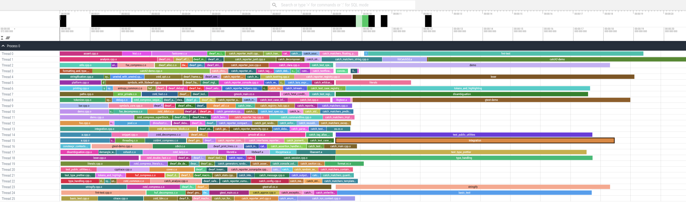
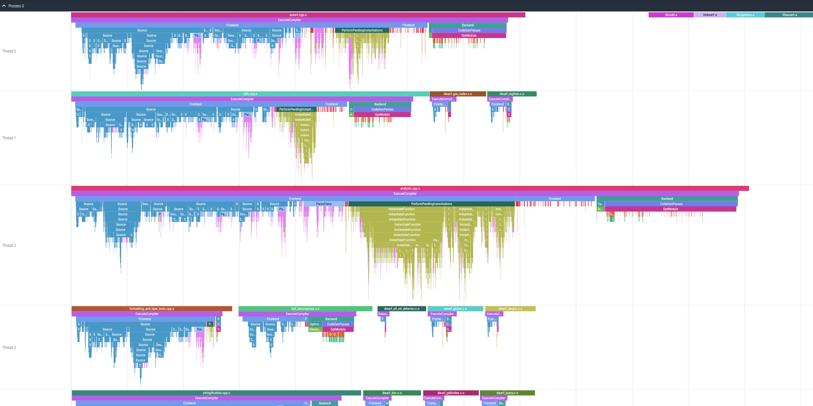

# build-blame

Build-blame is tool to help answer the question: Why are my builds taking so long??

Note: This is very much a work-in-progress. The ease of use is nowhere near what I would consider acceptable for a
finished project.

Currently it requires a project using ninja and clang and a compile_commands.json file.

Preview:





## How to use:

In your project
```
cmake -B build -S . -DCMAKE_CXX_COMPILER=clang++-17 -DCMAKE_C_COMPILER=clang-17 -DCMAKE_BUILD_TYPE=Debug -DCMAKE_EXPORT_COMPILE_COMMANDS=On -GNinja -DCMAKE_CXX_FLAGS=-ftime-trace -DCMAKE_C_FLAGS=-ftime-trace
```

Then
```
python3 main.py --project-folder /path/to/project/ --build-folder /path/to/project/build --output out
```
