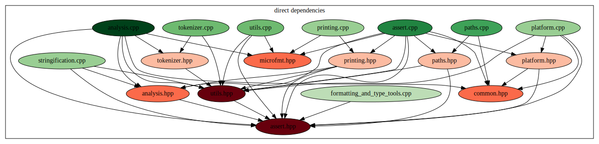

# build-blame

Build-blame is tool to help answer the question: Why are my builds taking so long??

Note: This is very much a work-in-progress. The ease of use is nowhere near what I would consider acceptable for a
finished project.

Currently it requires a project using ninja and clang and a compile_commands.json file.

Preview:




## How to use:

In your project
```
cmake -B build -S . -DCMAKE_CXX_COMPILER=clang++-17 -DCMAKE_C_COMPILER=clang-17 -DCMAKE_BUILD_TYPE=Debug -DCMAKE_EXPORT_COMPILE_COMMANDS=On -GNinja -DCMAKE_CXX_FLAGS=-ftime-trace -DCMAKE_C_FLAGS=-ftime-trace
```

Then
```
python3 main.py --project-folder /path/to/project --output out
```

## Example Statistics

Example output, on top of traces and graphs above:

```
Slowest translation unit targets:
      Time  Count  Target
    3.797s  1      /home/rifkin/projects/libassert/build-clang/_deps/googletest-src/googletest/src/gtest-all.cc
     3.57s  1      /home/rifkin/projects/libassert/src/analysis.cpp
    3.316s  1      /home/rifkin/projects/libassert/tests/integration/integration.cpp
    2.795s  1      /home/rifkin/projects/libassert/build-clang/_deps/cpptrace-src/src/symbols/symbols_with_libdwarf.cpp
    2.713s  1      /home/rifkin/projects/libassert/tests/demo/demo.cpp
    2.661s  1      /home/rifkin/projects/libassert/build-clang/_deps/googletest-src/googlemock/src/gmock-all.cc
    2.604s  1      /home/rifkin/projects/libassert/tests/unit/lexer.cpp
    2.407s  1      /home/rifkin/projects/libassert/tests/unit/literals.cpp
    2.349s  1      /home/rifkin/projects/libassert/build-clang/_deps/zstd-src/lib/compress/zstd_lazy.c
    2.331s  1      /home/rifkin/projects/libassert/tests/unit/fmt-test.cpp
    2.246s  1      /home/rifkin/projects/libassert/tests/unit/stringify.cpp
    2.006s  1      /home/rifkin/projects/libassert/src/assert.cpp
    1.819s  1      /home/rifkin/projects/libassert/tests/binaries/catch2-demo.cpp
    1.802s  1      /home/rifkin/projects/libassert/build-clang/_deps/catch2-src/src/catch2/catch_session.cpp
     1.77s  1      /home/rifkin/projects/libassert/tests/binaries/gtest-demo.cpp
    1.711s  1      /home/rifkin/projects/libassert/build-clang/_deps/googletest-src/googlemock/src/gmock_main.cc
    1.705s  1      /home/rifkin/projects/libassert/build-clang/_deps/catch2-src/src/catch2/internal/catch_commandline.cpp
    1.646s  1      /home/rifkin/projects/libassert/src/paths.cpp
     1.64s  1      /home/rifkin/projects/libassert/build-clang/_deps/cpptrace-src/src/cpptrace.cpp
    1.608s  1      /home/rifkin/projects/libassert/src/utils.cpp
 1m 54.85s  229    Other

Slowest link targets:
    Time  Count  Target
 10.712s  1      fmt-test
 10.528s  1      lexer
 10.449s  1      catch2-demo
 10.384s  1      gtest-demo
 10.189s  1      integration
 10.003s  1      stringify
  9.991s  1      demo
  9.204s  1      type_handling
  9.198s  1      test_public_utilities
  9.147s  1      basic_test
  9.064s  1      disambiguation
  8.994s  1      test_type_prettier
  8.985s  1      tokens_and_highlighting
  2.299s  1      literals
  1.665s  1      _deps/catch2-build/src/libCatch2d.a
   808ms  1      _deps/zstd-build/lib/libzstd.a
   609ms  1      _deps/cpptrace-build/libcpptrace.a
   443ms  1      _deps/libdwarf-build/src/lib/libdwarf/libdwarf.a
   371ms  1      libassert.a
   297ms  1      lib/libgtest.a
   612ms  6      Other

Frontend/Backend:
      Time  Count  Target
 1m 54.87s  406    Frontend
   17.861s  248    Backend

Includes:
         Time  Count  Target
   350m 5.29s  133    /usr/bin/../lib/gcc/x86_64-linux-gnu/13/../../../../include/c++/13/string
  257m 34.60s  28     /home/rifkin/projects/libassert/include/libassert/assert.hpp
  238m 22.07s  104    /usr/bin/../lib/gcc/x86_64-linux-gnu/13/../../../../include/c++/13/ios
  214m 46.24s  104    /usr/bin/../lib/gcc/x86_64-linux-gnu/13/../../../../include/c++/13/ostream
  168m 20.68s  107    /usr/bin/../lib/gcc/x86_64-linux-gnu/13/../../../../include/c++/13/bits/ios_base.h
  164m 45.54s  133    /usr/bin/../lib/gcc/x86_64-linux-gnu/13/../../../../include/c++/13/bits/basic_string.h
  158m 43.60s  72     /home/rifkin/projects/libassert/build-clang/_deps/catch2-src/src/catch2/../catch2/internal/catch_stringref.hpp
   118m 2.46s  107    /usr/bin/../lib/gcc/x86_64-linux-gnu/13/../../../../include/c++/13/bits/locale_classes.h
  106m 26.69s  49     /home/rifkin/projects/libassert/build-clang/_deps/catch2-src/src/catch2/../catch2/internal/catch_reusable_string_stream.hpp
  103m 36.87s  19     /home/rifkin/projects/libassert/build-clang/_deps/catch2-src/src/catch2/../catch2/interfaces/catch_interfaces_reporter.hpp
  102m 31.32s  7      /home/rifkin/projects/libassert/build-clang/_deps/googletest-src/googletest/include/gtest/gtest.h
    90m 6.77s  44     /usr/bin/../lib/gcc/x86_64-linux-gnu/13/../../../../include/c++/13/memory
   82m 30.24s  23     /home/rifkin/projects/libassert/build-clang/_deps/catch2-src/src/catch2/../catch2/catch_tostring.hpp
    79m 0.74s  12     /home/rifkin/projects/libassert/build-clang/_deps/catch2-src/src/catch2/../catch2/internal/catch_assertion_handler.hpp
   78m 33.74s  13     /home/rifkin/projects/libassert/build-clang/_deps/catch2-src/src/catch2/../catch2/reporters/catch_reporter_common_base.hpp
   72m 54.26s  108    /usr/bin/../lib/gcc/x86_64-linux-gnu/13/../../../../include/c++/13/vector
   66m 39.92s  10     /home/rifkin/projects/libassert/build-clang/_deps/catch2-src/src/catch2/../catch2/matchers/internal/catch_matchers_impl.hpp
   64m 41.41s  34     /home/rifkin/projects/libassert/build-clang/_deps/cpptrace-src/include/cpptrace/cpptrace.hpp
   62m 55.62s  105    /usr/bin/../lib/gcc/x86_64-linux-gnu/13/../../../../include/c++/13/bits/locale_facets.h
    61m 4.86s  10     /home/rifkin/projects/libassert/build-clang/_deps/catch2-src/src/catch2/../catch2/matchers/catch_matchers.hpp
 4356m 26.35s  636    Other

Includes excluding children:
        Time  Count  Target
  72m 15.39s  133    /usr/bin/../lib/gcc/x86_64-linux-gnu/13/../../../../include/c++/13/bits/basic_string.h
  36m 18.53s  28     /home/rifkin/projects/libassert/include/libassert/assert.hpp
  34m 15.73s  105    /usr/bin/../lib/gcc/x86_64-linux-gnu/13/../../../../include/c++/13/bits/locale_facets.tcc
  33m 20.19s  143    /usr/bin/../lib/gcc/x86_64-linux-gnu/13/../../../../include/c++/13/type_traits
  32m 21.96s  72     /usr/bin/../lib/gcc/x86_64-linux-gnu/13/../../../../include/c++/13/bits/chrono.h
  31m 34.56s  228    /usr/include/features.h
  31m 32.07s  136    /usr/bin/../lib/gcc/x86_64-linux-gnu/13/../../../../include/c++/13/tuple
  22m 57.07s  111    /usr/bin/../lib/gcc/x86_64-linux-gnu/13/../../../../include/c++/13/bits/stl_bvector.h
  20m 57.42s  136    /usr/bin/../lib/gcc/x86_64-linux-gnu/13/../../../../include/c++/13/bits/stl_function.h
  20m 20.92s  138    /usr/bin/../lib/gcc/x86_64-linux-gnu/13/../../../../include/c++/13/bits/stl_algobase.h
  19m 26.89s  198    /usr/include/stdlib.h
   19m 9.41s  133    /usr/bin/../lib/gcc/x86_64-linux-gnu/13/../../../../include/c++/13/string_view
  18m 36.78s  100    /usr/bin/../lib/gcc/x86_64-linux-gnu/13/../../../../include/c++/13/limits
  16m 37.90s  105    /usr/bin/../lib/gcc/x86_64-linux-gnu/13/../../../../include/c++/13/bits/locale_facets.h
  15m 57.00s  107    /usr/bin/../lib/gcc/x86_64-linux-gnu/13/../../../../include/c++/13/bits/ios_base.h
  15m 55.51s  28     /home/rifkin/projects/libassert/build-clang/_deps/magic_enum-src/include/magic_enum/magic_enum.hpp
  13m 58.93s  107    /usr/bin/../lib/gcc/x86_64-linux-gnu/13/../../../../include/c++/13/system_error
  13m 25.59s  49     /usr/bin/../lib/gcc/x86_64-linux-gnu/13/../../../../include/c++/13/bits/stl_tree.h
  13m 20.27s  37     /usr/bin/../lib/gcc/x86_64-linux-gnu/13/../../../../include/c++/13/bits/unordered_map.h
  13m 15.04s  133    /usr/bin/../lib/gcc/x86_64-linux-gnu/13/../../../../include/c++/13/ext/string_conversions.h
 964m 13.43s  636    Other

Instantiations:
         Time  Count  Target
   13m 40.01s  3      std::basic_regex<char>::_M_compile
    13m 2.33s  3      std::__detail::_Compiler<std::regex_traits<char>>::_Compiler
   11m 45.17s  7      std::vformat_to<std::__format::_Sink_iter<char>>
   11m 44.17s  7      std::__format::__do_vformat_to<std::__format::_Sink_iter<char>, char, std::basic_format_context<std::__format::_Sink_iter<char>, char>>
   11m 27.17s  1      test_class<int>::something<N>
   11m 27.15s  1      test_class<int>::something_else
   11m 13.34s  3      std::__detail::_Compiler<std::regex_traits<char>>::_M_disjunction
    11m 9.24s  3      std::__detail::_Compiler<std::regex_traits<char>>::_M_alternative
   10m 59.62s  3      std::__detail::_Compiler<std::regex_traits<char>>::_M_term
    10m 8.47s  7      std::vformat_to<std::__format::_Sink_iter<wchar_t>>
    10m 7.18s  7      std::__format::__do_vformat_to<std::__format::_Sink_iter<wchar_t>, wchar_t, std::basic_format_context<std::__format::_Sink_iter<wchar_t>, wchar_t>>
    9m 31.99s  7      std::__format::_Formatting_scanner<std::__format::_Sink_iter<char>, char>::_Formatting_scanner
    9m 18.59s  3      std::__detail::_Compiler<std::regex_traits<char>>::_M_atom
    8m 33.17s  7      std::__format::_Formatting_scanner<std::__format::_Sink_iter<char>, char>::_M_format_arg
    8m 11.38s  7      std::__format::_Formatting_scanner<std::__format::_Sink_iter<wchar_t>, wchar_t>::_Formatting_scanner
    7m 55.85s  2      std::basic_regex<char>::basic_regex<std::char_traits<char>, std::allocator<char>>
     7m 1.40s  7      std::__format::_Formatting_scanner<std::__format::_Sink_iter<wchar_t>, wchar_t>::_M_format_arg
     6m 6.39s  133    __gnu_cxx::__to_xstring<std::basic_string<wchar_t>, wchar_t>
    5m 57.66s  133    std::basic_string<char16_t>
    5m 45.02s  1      std::basic_regex<char>::basic_regex
 1065m 57.95s  10152  Other

Instantiations excluding children:
        Time  Count  Target
   5m 47.51s  133    std::basic_string<char16_t>
   5m 23.19s  133    std::basic_string<char>
   5m 18.56s  133    std::basic_string<wchar_t>
   5m 18.18s  133    std::basic_string<char32_t>
    3m 6.63s  133    std::basic_string<char32_t>::_M_construct<const char32_t *>
   2m 59.29s  133    std::basic_string<char16_t>::_M_construct<const char16_t *>
   2m 25.09s  133    std::basic_string<wchar_t>::_M_construct<wchar_t *>
   1m 48.13s  207    std::operator+<char, std::char_traits<char>, std::allocator<char>>
   1m 47.50s  37     std::_Hashtable<int, std::pair<const int, int>, std::allocator<std::pair<const int, int>>, std::__detail::_Select1st, std::equal_to<int>, std::hash<int>, std::__detail::_Mod_range_hashing, std::__detail::_Default_ranged_hash, std::__detail::_Prime_rehash_policy, std::__detail::_Hashtable_traits<false, false, true>>
   1m 27.60s  110    std::basic_string<char>::_M_construct<char *>
   1m 25.82s  133    __gnu_cxx::__to_xstring<std::basic_string<wchar_t>, wchar_t>
   1m 23.73s  98     std::__str_concat<std::basic_string<char>>
   1m 20.42s  72     std::chrono::operator<<long, std::ratio<1, 1000000000>, long, std::ratio<1, 1000000000>>
   1m 20.11s  72     std::chrono::duration<long, std::ratio<1, 1000000000>>
   1m 18.41s  28     std::optional<std::basic_string<char>>
   1m 15.90s  37     std::_Hashtable<int, std::pair<const int, int>, std::allocator<std::pair<const int, int>>, std::__detail::_Select1st, std::equal_to<int>, std::hash<int>, std::__detail::_Mod_range_hashing, std::__detail::_Default_ranged_hash, std::__detail::_Prime_rehash_policy, std::__detail::_Hashtable_traits<false, false, false>>
   1m 11.54s  130    __gnu_cxx::__to_xstring<std::basic_string<char>, char>
    1m 6.88s  10     std::reverse_iterator<std::_Bit_iterator>
    1m 6.60s  1      test_class<int>::something_else
    1m 4.88s  133    std::basic_string<wchar_t>::basic_string<wchar_t *, void>
 282m 26.49s  10152  Other

Templates with the most total instantiation time:
        Time  Count  Target
  22m 38.78s  1494   std::__and_
  22m 31.09s  539    std::basic_string
  21m 53.64s  14     std::vformat_to
  21m 51.35s  14     std::__format::__do_vformat_to
  19m 51.30s  722    std::basic_string::basic_string
  18m 25.89s  112    std::unique_ptr
  17m 55.99s  6      magic_enum::detail::values
  17m 46.50s  6      magic_enum::detail::valid_count
  17m 43.37s  14     std::__format::_Formatting_scanner::_Formatting_scanner
  17m 15.00s  633    std::vector
  16m 22.41s  133    libassert::detail::process_assert_fail
   16m 7.28s  150    libassert::detail::generate_stringification
  15m 39.62s  46     testing::internal::MatcherBase::MatcherBase
  15m 34.57s  14     std::__format::_Formatting_scanner::_M_format_arg
  15m 33.68s  112    std::__uniq_ptr_data
  15m 33.42s  46     testing::internal::MatcherBase::Init
  15m 23.25s  112    std::__uniq_ptr_impl
  15m 15.15s  579    std::basic_string::_M_construct
  14m 21.00s  559    std::_Destroy
  13m 43.79s  94     libassert::detail::process_assert_fail_n
 909m 36.18s  1219   Other

Templates with the most total instantiation time excluding children:
        Time  Count  Target
   22m 4.42s  539    std::basic_string
  14m 36.89s  1494   std::__and_
  10m 51.96s  579    std::basic_string::_M_construct
    8m 3.27s  633    std::vector
   7m 21.64s  587    std::_Vector_base
    7m 3.55s  729    std::__or_
   6m 50.65s  473    std::chrono::duration
   6m 25.01s  332    std::pair
   6m 15.15s  595    magic_enum::detail::is_valid
   5m 35.53s  174    std::tuple
   5m 12.00s  722    std::basic_string::basic_string
   4m 18.35s  105    std::_Hashtable
    4m 3.10s  340    __gnu_cxx::__stoa
   3m 59.38s  42     std::__format::__formatter_fp::format
   3m 56.18s  158    std::vector::_M_realloc_insert
   3m 43.30s  266    std::is_destructible
   3m 22.80s  226    std::_Tuple_impl
   3m 15.22s  126    std::__format::__formatter_int::format
    3m 2.12s  112    std::__uniq_ptr_impl
   2m 59.12s  69     std::optional
 197m 22.80s  1219   Other

Slow parses:
       Time  Count  Target
 17m 56.21s  222    std::vector
 17m 32.79s  133    std::basic_string
 14m 50.01s  28     libassert::assertion_info
 13m 54.29s  272    std::tuple
 10m 32.36s  72     std::chrono::system_clock
  9m 27.50s  811    std::numeric_limits
  8m 14.27s  507    std::char_traits
  5m 31.98s  49     std::_Rb_tree
  5m 24.86s  1      test_class
   5m 1.22s  133    std::basic_string_view
  4m 33.86s  136    std::pair
  4m 11.61s  88     std::__atomic_base
   4m 3.01s  107    std::ios_base
  3m 54.74s  252    std::_Tuple_impl
  3m 44.39s  37     std::__detail::_Power2_rehash_policy
  3m 44.24s  11     std::__detail::_ScannerBase
  3m 41.32s  28     magic_enum::customize::customize_t
  3m 10.01s  166    std::allocator_traits
   3m 6.03s  1      foo
  2m 56.48s  252    std::hash
 169m 2.44s  706    Other

Slow parses excluding children:
       Time  Count  Target
 17m 53.57s  222    std::vector
 17m 32.79s  133    std::basic_string
 14m 50.01s  28     libassert::assertion_info
 13m 54.29s  272    std::tuple
 10m 32.36s  72     std::chrono::system_clock
  9m 27.50s  811    std::numeric_limits
  8m 14.27s  507    std::char_traits
  5m 31.05s  49     std::_Rb_tree
  5m 24.86s  1      test_class
   5m 1.22s  133    std::basic_string_view
  4m 33.86s  136    std::pair
  4m 11.61s  88     std::__atomic_base
   4m 3.01s  107    std::ios_base
  3m 54.74s  252    std::_Tuple_impl
  3m 44.39s  37     std::__detail::_Power2_rehash_policy
  3m 44.24s  11     std::__detail::_ScannerBase
  3m 41.32s  28     magic_enum::customize::customize_t
   3m 9.29s  166    std::allocator_traits
   3m 6.03s  1      foo
  2m 56.48s  252    std::hash
 167m 3.13s  706    Other

Slow codegen:
       Time  Count  Target
  2m 34.15s  49     std::basic_string<char>::basic_string<std::allocator<char>>
    59.879s  11     main
    39.239s  1      test_class<int>::something_else
    34.047s  13     cpptrace::raw_trace::~raw_trace
    27.437s  13     std::vector<std::basic_string<char>>::vector
    25.466s  9      std::basic_string<char>::basic_string<std::basic_string_view<char>, void>
    20.984s  4      std::vector<std::pair<long, std::vector<std::sub_match<__gnu_cxx::__normal_iterator<const char *, std::basic_string<char>>>>>>::vector
    19.864s  7      std::_Rb_tree<std::basic_string<char>, std::pair<const std::basic_string<char>, std::basic_string<char>>, std::_Select1st<std::pair<const std::basic_string<char>, std::basic_string<char>>>, std::less<std::basic_string<char>>>::_Rb_tree
    19.582s  13     std::vector<unsigned long>::vector
    19.304s  1      __gnu_cxx::__alloc_traits<std::allocator<std::pair<char, char>>>::_S_select_on_copy
    17.714s  1      foo::baz
    16.906s  7      microfmt::detail::format<4UL>
    13.084s  6      std::map<std::basic_string<char>, std::basic_string<char>>::map
    11.882s  2      _dwarf_read_line_table_header
    11.125s  2      std::_Hashtable<std::basic_string<char>, std::pair<const std::basic_string<char>, std::basic_string<char>>, std::allocator<std::pair<const std::basic_string<char>, std::basic_string<char>>>, std::__detail::_Select1st, std::equal_to<std::basic_string<char>>, std::hash<std::basic_string<char>>, std::__detail::_Mod_range_hashing, std::__detail::_Default_ranged_hash, std::__detail::_Prime_rehash_policy, std::__detail::_Hashtable_traits<true, false, true>>::_Hashtable
    11.092s  1      _dwarf_exec_frame_instr
    11.065s  2      std::vector<libassert::extra_diagnostic>::vector
    10.748s  1      libassert::detail::analysis::analysis
    10.629s  3      std::vector<std::pair<std::basic_string<char>, std::basic_string<char>>>::vector
     10.47s  1      _dwarf_internal_get_pubnames_like
 35m 52.67s  1621   Other

Slow codegen excluding children:
       Time  Count  Target
  2m 34.15s  49     std::basic_string<char>::basic_string<std::allocator<char>>
    59.879s  11     main
    39.239s  1      test_class<int>::something_else
    34.047s  13     cpptrace::raw_trace::~raw_trace
    27.437s  13     std::vector<std::basic_string<char>>::vector
    25.466s  9      std::basic_string<char>::basic_string<std::basic_string_view<char>, void>
    20.984s  4      std::vector<std::pair<long, std::vector<std::sub_match<__gnu_cxx::__normal_iterator<const char *, std::basic_string<char>>>>>>::vector
    19.864s  7      std::_Rb_tree<std::basic_string<char>, std::pair<const std::basic_string<char>, std::basic_string<char>>, std::_Select1st<std::pair<const std::basic_string<char>, std::basic_string<char>>>, std::less<std::basic_string<char>>>::_Rb_tree
    19.582s  13     std::vector<unsigned long>::vector
    19.304s  1      __gnu_cxx::__alloc_traits<std::allocator<std::pair<char, char>>>::_S_select_on_copy
    17.714s  1      foo::baz
    16.906s  7      microfmt::detail::format<4UL>
    13.084s  6      std::map<std::basic_string<char>, std::basic_string<char>>::map
    11.882s  2      _dwarf_read_line_table_header
    11.125s  2      std::_Hashtable<std::basic_string<char>, std::pair<const std::basic_string<char>, std::basic_string<char>>, std::allocator<std::pair<const std::basic_string<char>, std::basic_string<char>>>, std::__detail::_Select1st, std::equal_to<std::basic_string<char>>, std::hash<std::basic_string<char>>, std::__detail::_Mod_range_hashing, std::__detail::_Default_ranged_hash, std::__detail::_Prime_rehash_policy, std::__detail::_Hashtable_traits<true, false, true>>::_Hashtable
    11.092s  1      _dwarf_exec_frame_instr
    11.065s  2      std::vector<libassert::extra_diagnostic>::vector
    10.748s  1      libassert::detail::analysis::analysis
    10.629s  3      std::vector<std::pair<std::basic_string<char>, std::basic_string<char>>>::vector
     10.47s  1      _dwarf_internal_get_pubnames_like
 35m 52.67s  1621   Other
```
